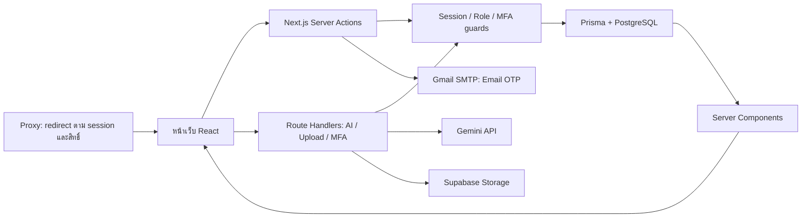

# Prompty — บริบทโปรเจกต์สำหรับกลับมาทำงานต่อ

ตรวจจากโค้ดในเครื่องวันที่ 29 กันยายน 2026 · branch `main` · commit `0011a23`

## สถานะและที่มาของบันทึก

เจ้าของยืนยันว่า **โปรเจกต์เสร็จแล้ว** การอ่านรอบนี้มีจุดประสงค์เพื่อสร้างความเข้าใจใหม่หลังติดตั้ง Codex ใหม่และไม่พบประวัติแชตเดิม ไม่ใช่คำสั่งให้พัฒนาฟีเจอร์หรือแก้บั๊กต่อโดยอัตโนมัติ

บันทึกนี้สังเคราะห์จาก source code, schema, config, tests, Git history, เอกสารส่งมอบ และ source ของเอกสารนำเสนอใน `tmp/pdfs` ไม่ใช่การกู้คืนข้อความแชตเก่า และไม่ยืนยันสถานะของเว็บ production หรือฐานข้อมูลจริง

รอบนี้อ่านโครงสร้างและตรรกะทุกกลุ่มของแอป รวมถึง handler/state ของ Client Components และจุดเชื่อม UI กับ server; ส่วน JSX/CSS ตรวจรูปแบบและองค์ประกอบสำคัญ ไม่ได้ตรวจภาพทุกหน้าผ่านเบราว์เซอร์ ไม่ได้อ่าน dependencies/generated files ทั้งหมด ไม่เปิดเผยค่าจาก `.env` และไม่เรียกบริการจริง

## 1. ผลิตภัณฑ์และบริบทการนำเสนอ

Prompty คือเว็บชุมชนสำหรับแบ่งปัน ค้นหา จัดเก็บ และนำ Code Snippets กับ AI Prompts กลับมาใช้ กลุ่มเป้าหมายในบทนำเสนอคือ developers, creators และนักศึกษา ปัญหาที่ต้องการแก้คือเนื้อหากระจายตามโซเชียล ค้นหาย้อนกลับยาก และคัดลอกไปใช้ไม่สะดวก

เส้นทางหลักคือ **ค้นพบ → พิจารณาเนื้อหา/โหวต/ความคิดเห็น → เก็บ → นำไปใช้** ผู้ใช้คัดลอกได้โดยไม่ต้องโหวตหรือบันทึกก่อน คะแนนเป็นข้อมูลการมีส่วนร่วม ไม่ใช่ผลรับรองคุณภาพหรือความปลอดภัยของโค้ด

AI เป็นผู้ช่วยในฟอร์มสร้าง/แก้โพสต์: ปรับข้อความหรือโค้ด และแนะนำแท็กเมื่อกดปุ่ม ไม่ใช่ AI Search, ไม่ได้รัน snippet ของผู้ใช้ และไม่ได้สร้างภาพจาก Prompt ภายในแอป

มีหลักฐานงานเตรียมนำเสนอที่ยังอยู่ในเครื่อง:

- `output/pdf/Prompty-slide-review.pdf`: รายงานตรวจสไลด์รอบแรก
- `output/pdf/Prompty-slide-review-v2.pdf`: รายงานรอบปรับปรุง; source ระบุวันที่ 28 กันยายน 2569 อ้าง commit เดียวกับปัจจุบัน
- `output/pdf/Prompty-presentation-script-3-speakers.pdf`: บทพูด 3 คน เป้าหมาย 13 นาที สำรอง 2 นาที
- `tmp/pdfs/build_review.py`, `build_review_v2.py`, `build_script.py`: source สร้างเอกสารและข้อความประกอบ

บทพูดแบ่งคนแรกเป็นภาพรวม/ฟีเจอร์ คนที่สองเป็นเทคโนโลยี/สถาปัตยกรรม/ผลทดสอบ และคนที่สามเป็นเดโม/ปิดการนำเสนอ Source ของรายงานรอบสองตรวจ Canva 17 หน้ารวมหน้าซ่อน ส่วนบทพูดอ้างชุดนำเสนอ 15 หน้า จึงไม่ควรสมมติว่าเลขสไลด์สองเอกสารตรงกันทั้งหมด

รายงานนำเสนอเดิมแยก Auto-Hide Reports เป็นงานต่อยอดแล้ว และเน้นแยก Email OTP ออกจาก MFA, Trending ออกจาก Leaderboard, automated tests ออกจากการทดสอบผ่านหน้าจอจริง ไม่ได้ตรวจ Canva หรือ PDF render ใหม่ในรอบอ่านโค้ดนี้

## 2. สถาปัตยกรรมและเทคโนโลยี

เป็น full-stack application ใน repository เดียว ไม่มี backend Express/Nest แยกออกไป

แผนภาพย่อส่วน mutation ที่ต้องตรวจสิทธิ์; read actions หลายตัวอ่านข้อมูลโดยตรงและไม่ได้ผ่าน `requireSession` ทุกตัว

| ส่วน | สิ่งที่ใช้จริง |
|---|---|
| Framework | Next.js **16.2.9**, App Router, `src/proxy.ts` |
| UI | React **19.2.4**, TypeScript strict, Lucide icons |
| Styles | Tailwind CSS 4 ผ่าน PostCSS ร่วมกับ CSS tokens, CSS รายหน้า และ inline styles จำนวนมาก |
| Database | PostgreSQL, Prisma Client **7.8.0**, `@prisma/adapter-pg` |
| Authentication | Auth.js/NextAuth **5.0.0-beta.31**, Credentials provider, JWT session, Prisma adapter |
| Password/MFA | bcryptjs, otplib, QRCode, Node crypto |
| Email | Nodemailer ผ่าน Gmail SMTP |
| Images | Supabase Storage, buckets `avatars` และ `post-images` |
| AI | `@google/generative-ai`; ชื่อโมเดลมาจาก `GEMINI_MODEL` หรือ fallback ในโค้ด |
| Code display/editing | highlight.js และ react-simple-code-editor |
| Admin chart | Recharts |
| Tests | Node test runner, TypeScript transpilation ใน VM, mocks, PGlite |

README เดิมระบุ Next.js 15 ซึ่งเก่ากว่า package และ dependency ที่ติดตั้งจริง; README ฉบับใหม่วันที่ 29 กันยายนแก้ข้อมูลนี้แล้ว การมีแพ็กเกจใน package.json เช่น PrismJS ไม่ได้แปลว่าเป็นเส้นทางที่ UI ใช้งานอยู่ในปัจจุบัน

จำนวนที่นับใหม่จาก source:

| หน่วย | จำนวนและวิธีนับ |
|---|---|
| `page.tsx` | 36 ไฟล์ |
| หน้าจอแบบที่ใช้ในงานนำเสนอ | 34 = 36 หัก `/settings` ที่ redirect และ intercepted post modal ที่ซ้ำกับ detail page |
| `src/components` | 40 ไฟล์ TSX |
| `*Client.tsx` ใต้ `src/app` | 12 ไฟล์; รวมกับข้างบนเป็น 52 component files รวม providers |
| Server Actions modules | 12 ไฟล์, 83 exported entries รวม helper/export แบบ cached function |
| API routes | 6 route files |
| Prisma models | 15 |

ตัวเลขเหล่านี้เป็นคนละหน่วย ไม่ควรบวกรวมเป็นจำนวนฟีเจอร์ และ “20 feature groups” ในเอกสารนำเสนอเป็นการจัดกลุ่มอธิบาย ไม่ใช่จำนวนที่เครื่องมือค้นไฟล์นับได้โดยตรง

## 3. แผนที่หน้าจอและการเข้าถึง

| กลุ่ม | Routes | พฤติกรรมหลัก |
|---|---|---|
| สมาชิก | `/register`, `/verify-email`, `/register/success`, `/login` | สมัคร ส่ง OTP ยืนยันอีเมล และเข้าสู่ระบบ |
| กู้รหัส | `/forgot-password`, `/reset-password`, `/reset-password/success` | ใช้ `/verify-email?flow=reset` เป็นขั้นกลาง |
| MFA | `/verify-mfa`, `/settings/security` | ยืนยันเพิ่มหลัง login และจัดการ TOTP |
| Feed/detail | `/`, `/post/[id]` | โพสต์ใหม่ล่าสุดและรายละเอียด |
| Discovery | `/trending`, `/categories`, `/categories/[slug]`, `/tags`, `/tags/[tag]`, `/search` | จัดอันดับ/จัดกลุ่ม/ค้นหา |
| Ranking | `/leaderboard` | อันดับผู้ใช้และอันดับของตนเอง |
| Profile | `/profile`, `/profile/[id]` | ของตนเองแก้/ลบโพสต์ได้; ของผู้อื่นติดตามได้ |
| Bookmarks | `/bookmarks`, `/collections/[id]` | จัดคอลเลกชันและเปิดลิงก์ที่แชร์ |
| Settings | `/settings/profile`, `/settings/account`, `/settings/notifications`, `/settings/appearance` | ข้อมูลส่วนตัว รหัสผ่าน/ลบบัญชี แจ้งเตือน ธีม |
| Admin | `/admin/login`, `/admin`, `/admin/posts`, `/admin/posts/reports`, `/admin/users`, `/admin/tags`, `/admin/settings` | บริหารระบบ |
| Maintenance | `/maintenance` | หน้าปิดปรับปรุงสำหรับผู้ใช้ทั่วไป |

`proxy.ts` ตรวจตามลำดับ: บัญชีถูกแบน → MFA ค้าง → maintenance → admin role → public paths → บังคับ login สำหรับเส้นทางที่เหลือ หน้า Feed, Search, Trending และโปรไฟล์ที่เรียกว่า public ในชื่อฟังก์ชัน **ยังถูก proxy บังคับ login** ส่วน `/collections/...` อยู่ใน allowlist; private collection ตรวจเจ้าของภายใน action อีกชั้น

API ถูกยกเว้นจาก proxy matcher จึงต้องตรวจ session ภายใน route/action เอง หน้า login/register จะเปลี่ยนทางไปหน้าหลักหรือ Admin หากมี session อยู่แล้ว

`src/app/@modal/(.)post/[id]/page.tsx` ทำให้เปิดโพสต์จากการนำทางภายในเป็น modal ซ้อนหน้าปัจจุบัน ส่วนเปิด URL ตรง/refresh เป็นหน้ารายละเอียดเต็ม ใช้ `router.back()` ปิด modal, Escape ปิดได้ และล็อกการ scroll พื้นหลัง ลิงก์ภายใน modal ใช้ full navigation เพื่อเคลียร์ parallel route ตามการแก้ในประวัติ Git

## 4. โครงสร้างข้อมูล

| Model | หน้าที่และความสัมพันธ์ |
|---|---|
| `User` | ชื่อ อีเมล handle โปรไฟล์ role/status การตั้งค่า และข้อมูล MFA; เป็นเจ้าของ posts/collections และกิจกรรมต่าง ๆ |
| `Account`, `Session` | Models รองรับ Auth.js adapter; flow ปัจจุบันใช้ Credentials + JWT ไม่ใช่ database-session strategy |
| `VerificationToken` | ใช้เก็บ reset grants, pending MFA setup, MFA session grants และ replay markers โดยแยก identifier prefix |
| `OtpCode` | Email OTP เก็บค่า HMAC และเวลาหมดอายุ |
| `Post` | ชนิด CODE/PROMPT, title/description/content, language/aiModel/imageUrl, tags array, copyCount, author |
| `Vote` | UP/DOWN; unique `(userId, postId)` |
| `Comment` | ข้อความกับผู้เขียนและโพสต์; ไม่มี parent/reply relation |
| `Report` | เหตุผล PENDING/RESOLVED/DISMISSED และ snapshot ชื่อโพสต์/ผู้เขียน |
| `BookmarkCollection` | ชื่อ คำอธิบาย public/private เจ้าของ; unique `(userId, name)` |
| `Bookmark` | unique `(userId, postId)`, optional collectionId; หนึ่งโพสต์อยู่ได้หนึ่ง collection ต่อผู้ใช้ |
| `Follow` | unique `(followerId, followingId)` |
| `Notification` | ชนิด ข้อความ link isRead และเจ้าของ |
| `Tag` | รายชื่อแท็กกับ VISIBLE/HIDDEN; ไม่มี foreign-key relation กับ Post.tags |
| `SystemSetting` | ค่าระบบแบบ string key/value และ rate-limit state ที่ใช้ prefix `__rate:` |

ไม่มีตาราง Category, CopyEvent, AIConversation หรือ comment thread แยกต่างหาก ค่า role/status/type หลายชนิดเป็น String ไม่ใช่ Prisma enum

การลบ user/post หลาย relation cascade; Report.postId ใช้ SetNull เพื่อคงรายงานไว้หลังโพสต์ถูกลบ และการลบ collection ทำให้ bookmark.collectionId เป็น null ไม่ลบ bookmark

`prisma.config.ts` เลือก `DIRECT_URL` ก่อน `DATABASE_URL` สำหรับ Prisma tooling ส่วน runtime ใช้ `DATABASE_URL` ผ่าน pg adapter โฟลเดอร์ Prisma ปัจจุบันมี schema แต่ไม่พบ migration files จึงไม่ควรสมมติว่ามี migration history อยู่ใน checkout นี้

## 5. สมัครสมาชิก เข้าสู่ระบบ และความปลอดภัย

### Email/password และ OTP

1. สมัครด้วย name/email/password, normalize อีเมลเป็น lowercase, bcrypt cost 12, สร้างบัญชีที่ยังไม่ยืนยัน
2. ส่ง OTP 6 หลัก อายุ 10 นาที ผ่าน Gmail SMTP; ใช้ crypto random และ HMAC ที่แยก purpose `register`/`reset`
3. ยืนยัน purpose ให้ตรงและ consume OTP ใน transaction; การสมัครจะตั้ง emailVerified
4. Login UI เรียก preflight `authenticate` แล้ว `signIn('credentials')`; preflight ไม่สร้าง session
5. Credentials authorize ตรวจบัญชี อีเมลยืนยัน สถานะแบน และรหัสผ่าน ก่อนออก JWT
6. Reset ต้องยืนยัน OTP ก่อนจึงได้ random grant ใน HttpOnly/SameSite strict cookie path `/reset-password`; ใน DB เก็บ digest อายุ 10 นาที ใช้ครั้งเดียวและผูกอีเมล
7. เปลี่ยนรหัสผ่านแล้ว JWT เก่าไม่ผ่าน credentialVersion ซึ่งคำนวณจาก passwordHash; helper ฝั่ง account settings sign-out แล้วพาไป `/login` บน origin เดิม

รหัสผ่านขั้นต่ำ 8 ตัวอักษร สูงสุด 72 ไบต์ตาม bcrypt จึงไม่เท่ากับสูงสุด 72 ตัวอักษรสำหรับภาษาไทย OAuth Google/GitHub ยังไม่ใช่ flow ที่ตั้งค่าใช้งานจริง

### Session และสิทธิ์

- JWT มี user ID, UUID sessionId และ credentialVersion
- Session callback อ่าน role/status/emailVerified/passwordHash/MFA ปัจจุบันจาก DB และปฏิเสธ session เก่า/ตรวจไม่ได้
- `requireSession()` ตรวจ id, ACTIVE, MFA และ maintenance; `verifiedSession()` คืน null เมื่อ guard ไม่ผ่าน
- `requireAdmin()` เรียก session guard แล้วตรวจ role จาก DB เพิ่ม
- มี guards ใน mutation หลัก แต่ไม่ควรสรุปว่า read Server Actions ทั้งหมดมี authorization แบบเดียวกัน

### MFA

- ผู้ใช้เลือกเปิดใน Security Settings; server สร้าง TOTP secret กับ QR และเก็บ pending setup อายุ 10 นาทีผูก session
- Confirm ต้องตรง secret ที่ server ออกให้และ TOTP ถูกต้อง ไม่ให้เขียนทับ MFA ที่เปิดอยู่
- Secret เข้ารหัส AES-256-GCM โดย derive key จาก AUTH_SECRET
- ออกรหัสสำรอง 8 ชุด เก็บ bcrypt hashes; UI ให้ copy/download ตอนเปิดสำเร็จ
- แต่ละ login มี sessionId ต่างกัน MFA grant ผูก user + session + encrypted secret อายุ 30 วัน; ยืนยันบัญชีเดียวกันในหน้าต่างหนึ่งไม่ได้ยืนยันอีก session
- TOTP replay marker อายุ 90 วินาที และ backup code consume ภายใน transaction พร้อม row lock
- ปิด MFA ต้องใช้รหัสผ่านกับ TOTP; ล้าง secrets/codes/grants ที่เกี่ยวข้อง
- ไม่มีหน้า Admin reset MFA หรือระบบออก backup codes ใหม่แยกต่างหากใน source ปัจจุบัน
- เปลี่ยน AUTH_SECRET กระทบทั้ง session/OTP digest และการถอดรหัส MFA secret เดิม ต้องวางแผนการเปลี่ยนโดยคำนึงถึงผู้ใช้ที่เปิด MFA

### Rate limits ที่เป็นกติกาในโค้ด

| รายการ | เพดาน |
|---|---|
| สมัคร | 5/ชั่วโมง/อีเมล |
| Login, login preflight, admin preflight | แต่ละ scope 10/15 นาที/อีเมล |
| ส่ง OTP | 1/นาที และ 5/ชั่วโมง/อีเมล; รวม 100/ชั่วโมง |
| ตรวจ OTP | 10/15 นาที/อีเมล |
| Reset/change password ฝั่งสมาชิก | แต่ละ scope 5/15 นาที |
| เริ่มตั้ง MFA | 5/15 นาที/ผู้ใช้ |
| ตรวจ MFA | scope ร่วม 10/15 นาที/ผู้ใช้ |
| AI | scope ร่วม 5/นาที และ 40/วัน/ผู้ใช้ |
| Upload | 10/นาที/ผู้ใช้ ใช้ scope ร่วมทั้งสอง bucket |
| Copy tracking | 60/นาที/ผู้ใช้ |

ตัวจำกัดใช้ atomic PostgreSQL upsert ใน SystemSetting เป็น fixed window reset เมื่อหมดเวลา ไม่ใช่ memory counter ของ server instance และการลองสำเร็จก็นับด้วย ไม่มี rate limiter แยกในทุก social mutation หรือทุก Admin action

## 6. โพสต์และชุมชน

- CODE กับ PROMPT อยู่ตารางเดียวกัน PostModal ใช้ร่วมทั้งสร้างและแก้; เปลี่ยน type ใน update action ไม่ได้
- CODE เลือกภาษา มี highlight.js auto-detect หลังหยุดพิมพ์ 600ms และ editor พร้อม syntax highlighting
- PROMPT เลือกชื่อโมเดลประกอบโพสต์ แนบภาพได้; preview เป็น local object URL และอัปโหลดเมื่อ submit
- title จำเป็น ส่วน description/content/image/tags อนุญาตว่างตาม server implementation ปัจจุบัน
- เจ้าของแก้/ลบโพสต์ตัวเอง Admin มีเส้นทางลบแยก
- Vote กดทิศเดิมซ้ำยกเลิก กดอีกทิศเปลี่ยน; คะแนน = UP − DOWN
- Comment เพิ่มข้อความธรรมดา ปุ่ม reply เติม `@handle` ลงกล่อง ไม่ได้สร้าง reply tree
- Share สร้างลิงก์ `/post/id`, copy link และเปิด share URLs ของ X/Facebook/LinkedIn/Reddit
- Copy มีทั้งปุ่มและ native copy event ใน code/prompt block; เก็บยอดรวม ไม่ใช่จำนวนผู้ใช้ไม่ซ้ำ และไม่ได้พิสูจน์ว่าผู้ใช้ได้นำไปใช้งานจริง
- Copy milestones 10, 50, 100, 1000 ส่ง notification ให้เจ้าของ
- Follow ห้ามติดตามตัวเอง; การเพิ่ม Follow/Comment/Vote ใหม่ส่ง notification ตาม preference และเงื่อนไขของ action
- Report ปฏิเสธการรายงานซ้ำของคนเดียวต่อโพสต์ด้วยการค้นก่อนเพิ่ม ไม่ได้มี unique constraint แบบ Vote

Post cards ถูกเขียนซ้ำใน Feed, Search, Trending, Tags, Categories, Profiles, Bookmarks และ Collection detail; มี shared copy/bookmark/modal components แต่ไม่ได้ใช้ PostCard เดียวทั้งแอป บางหน้าทำ optimistic state บางหน้าอาศัย revalidation และบางส่วน full reload

## 7. ค้นหา หมวดหมู่ และคะแนน

### Search

ค้นโพสต์ด้วย title/description และแท็กที่ตรงบางส่วน ไม่ได้ค้น content body หรือทำ semantic/vector search ค้นคนด้วย name/handle เฉพาะ USER ที่ไม่ถูกแบน และค้นแท็กจาก Post.tags โดยตัด HIDDEN ออก มีตัวกรอง type/language และเรียง latest/top

Post search คืนสูงสุด 50 รายการ และ user search สูงสุด 30; การเรียง top ของโพสต์เกิดหลังดึง 50 รายการล่าสุดแล้ว จึงไม่ใช่ top ของผลค้นทั้งหมดหากมีเกิน 50 รายการ Navbar submit ไป `/search?q=...`; ไม่พบ autocomplete dropdown ใน implementation ปัจจุบัน

### Categories และ Tags

Categories เป็น constants 7 หมวด: Frontend, Backend, Prompt Art, SEO, DevOps, UI/UX Design และอื่น ๆ ใช้ exact normalized matching จาก tags + language + aiModel กับ aliases ที่กำหนด หนึ่งโพสต์อยู่หลายหมวดได้ หากไม่ตรงเลยจะอยู่ `other` จำนวนรวมของทุกหมวดจึงอาจมากกว่าจำนวนโพสต์

Tag table ใช้บริหารชื่อ/สถานะ ส่วนแท็กของโพสต์เป็น array คนละส่วน Admin sync ชื่อจากโพสต์เข้าตารางเมื่อเรียกอ่านสถิติ/รายการแท็ก การซ่อนแท็กกรองออกจากรายการ/การค้นหาแท็ก ไม่ใช่ซ่อนโพสต์ทั้งโพสต์ การเปลี่ยนชื่อ Tag ไม่ได้ rewrite Post.tags อัตโนมัติ

### Ranking

| หน้าหรือข้อมูล | สูตร/ช่วงเวลา |
|---|---|
| Feed | โพสต์เรียงวันที่สร้างใหม่ก่อน |
| Trending | โพสต์เรียง UP − DOWN |
| Tag/category detail | เรียง UP − DOWN หลังกรองกลุ่ม |
| Leaderboard/Top Contributors | รวม `(copyCount + UP − DOWN)` ของโพสต์แต่ละผู้ใช้; เฉพาะ USER ที่ไม่ถูกแบน |
| week/month | เลือกโพสต์ที่สร้างย้อนหลัง 7/30 วันแล้วรวมยอดปัจจุบันของโพสต์เหล่านั้น ไม่ใช่เฉพาะ events ที่เกิดช่วงนั้น |

หน้าหลักของ Trending/Tags detail/Categories detail/Leaderboard เริ่มที่ all-time แม้ default parameter ของ actions หลายตัวเป็น week; Top Contributors ที่ sidebar ใช้ default week และ cache 5 นาที ส่วน all tags cache 10 นาที Categories อ่านจำนวนปัจจุบันโดยไม่ใช้ cache นั้น

## 8. Bookmarks, Notifications และ Settings

Bookmark เป็นของผู้ใช้หนึ่งคนต่อหนึ่งโพสต์ จะไม่จัดหมวดก็ได้หรือเลือก collection เดียว Collections สร้าง/เปลี่ยนชื่อ/ลบ/ย้ายโพสต์และสลับ public/private ได้ ต้องตรวจเจ้าของปลายทางก่อนย้าย/เพิ่ม Bookmark

Public profile แสดงเฉพาะ public collections ของเจ้าของ Private collection detail แสดงให้เจ้าของและคืน null สำหรับคนอื่น การลบ collection คง bookmark ไว้ใน “ทั้งหมด”

Notifications เก็บใน DB มี VOTE/COMMENT/FOLLOW/COPY_MILESTONE; dropdown ดึงล่าสุด 50 พร้อม unread count ทั้งหมด poll ทุก 60 วินาทีและ fetch เมื่อเปิด ไม่ได้ใช้ WebSocket/Supabase Realtime อ่านทีละรายการเมื่อ hover และมีปุ่มอ่านทั้งหมด

Settings แบ่ง Profile (ชื่อ handle bio social links avatar), Account (รหัสผ่าน/ลบบัญชี), Notifications, Appearance และ Security ผู้ใช้เลือก light/dark/system และ code theme 5 แบบได้ DB เป็นค่าหลักเมื่อ login ส่วน guest ใช้ localStorage; Admin ถูกบังคับ light theme

UI หลักเป็นภาษาไทย ฟอนต์ Inter + IBM Plex Sans Thai โทนแบรนด์สีน้ำเงิน มี sidebar/feed/cards/modal, CSS responsive หลาย breakpoints และ code theme CSS ที่เก็บไว้ใน `public/hljs` การมี responsive rules ไม่ใช่หลักฐานว่าทดสอบมือถือครบทุกหน้าจอแล้ว

## 9. Admin

- Dashboard: จำนวนผู้ใช้/โพสต์ โพสต์วันนี้ รายงานค้าง การเติบโต 30 วันเทียบ 30 วันก่อน กราฟรายวัน กิจกรรมล่าสุดจากโพสต์/สมัครสมาชิก และแท็กยอดนิยม
- Posts: ค้นชื่อ/ผู้เขียน กรองชนิดและวันที่ pagination 10 ต่อหน้า ดูรายละเอียดและลบ
- Reports: กรองสถานะและค้นหา จัดกลุ่มตามโพสต์; dismiss คงโพสต์ไว้, resolve บันทึก snapshot แล้วลบโพสต์ ไม่มีสถานะซ่อนโพสต์เฉพาะกิจ
- Users: ค้นชื่อ/handle/email กรอง role/status ดูสถิติ เปลี่ยนสิทธิ์หรือแบน เพิ่ม Admin ใหม่พร้อม verified email และลบบัญชีพร้อมข้อมูลที่เกี่ยวข้อง
- มีเงื่อนไขห้าม Admin ปลดสิทธิ์ตัวเองหรือใช้ admin deletion ลบตัวเอง แต่ไม่ใช่ระบบ policy ป้องกันทุกกรณี เช่น self-ban
- Tags: sync จากโพสต์ เพิ่ม/เปลี่ยนชื่อ/สลับสถานะ จัดอันดับตามจำนวนโพสต์หรือวันที่
- Settings: เปลี่ยนอีเมล/รหัสผ่าน Admin, maintenance และ auto-hide toggle
- Maintenance มีการใช้งานใน proxy และ session guard จริง; auto-hide toggle มีค่าบันทึกแต่ยังไม่พบ logic ซ่อนโพสต์ตามจำนวน reports

## 10. APIs และบริการภายนอก

| Route | หน้าที่ |
|---|---|
| `/api/auth/[...nextauth]` | GET/POST ของ Auth.js |
| `/api/mfa/verify` | POST ยืนยัน TOTP/backup code ด้วย session ฝั่ง server; ไม่เชื่อ userId ใน body |
| `/api/upload` | POST รูปโพสต์สูงสุด 10 MiB |
| `/api/upload-avatar` | POST avatar สูงสุด 5 MiB |
| `/api/ai/enhance` | POST ปรับ prompt/code |
| `/api/ai/suggest-tags` | POST แนะนำแท็ก |

Upload ตรวจ session/origin/rate/size และ magic bytes PNG/JPEG/GIF/WebP ให้ตรง MIME ก่อนอัปโหลดผ่าน service-role client ชื่อ object เป็น `userId/UUID.ext` คืน public URL ไม่พบการลบ object เดิมเมื่อเปลี่ยน/ลบภาพหรือโพสต์

AI ตรวจ type, title ไม่เกิน 200 และ content ไม่เกิน 12,000 ตัวอักษร ใช้ session guard กับ rate limits ร่วมกัน ค่า model fallback ในโค้ดคือ `gemini-3.6-flash` ซึ่งเป็นค่าที่อ่านพบ ไม่ได้ยืนยันว่า provider/account ยังรองรับชื่อนี้จริง

Enhance สำหรับ PROMPT สั่งเป็น prompt ภาษาอังกฤษสำหรับ image generators ไม่เกิน 80 คำ ส่วน CODE สั่งปรับ code/comment โดยรักษาฟังก์ชันเดิม Tags ขอ 3–5 คำเป็น JSON array; ทั้งคู่ตั้ง 4096 output tokens เรียกโมเดลหลักจาก GEMINI_MODEL (default gemini-3.6-flash) เมื่อเจอ 500/502/503/504 หรือ timeout จะสลับไป GEMINI_FALLBACK_MODEL (default gemini-3.1-flash-lite) พร้อม backoff รวมไม่เกิน 3 attempts ครั้งละ 15 วินาที งบเวลารวม 48 วินาที ไม่ retry 400/401/403/404/429 Route maxDuration 60 วินาที และ reject คำตอบว่าง/ถูก block/ถูกตัดด้วย MAX_TOKENS

ผล Enhance แสดงเทียบต้นฉบับก่อนผู้ใช้ยอมรับ Tags ต้องกดเลือกเพิ่มเอง โมเดลที่เลือกประกอบโพสต์ เช่น Midjourney v6 เป็น metadata ไม่ใช่การเปลี่ยน Gemini ที่ประมวลผลปุ่ม AI เมื่อ app limit ตอบ retryAfter UI มี countdown; provider quota error อาจไม่มีเวลาที่รอได้แน่นอน

Environment ที่เกี่ยวข้อง (ระบุชื่อเท่านั้น): `DATABASE_URL`, `DIRECT_URL`, `AUTH_SECRET`, `NEXTAUTH_URL`, `EMAIL_USER`, `EMAIL_PASS`, `NEXT_PUBLIC_SUPABASE_URL`, `NEXT_PUBLIC_SUPABASE_ANON_KEY`, `SUPABASE_SERVICE_ROLE_KEY`, `GEMINI_API_KEY`, `GEMINI_MODEL`

`src/lib/supabase.ts` มี anon client แต่ไม่พบ import ใช้งานใน src อื่น Upload runtime สร้าง service-role client เอง Config Next อนุญาต dev/tunnel origins และ Server Actions body limit 10 MB เอกสารนำเสนอพูดถึง GitHub/Vercel แต่รอบนี้ไม่ได้ตรวจ remote deployments หรือทดสอบ external connectivity

## 11. ผลตรวจรอบนี้

| การตรวจ 29 ก.ย. 2026 | ผล |
|---|---|
| `npm test` | **23/23 ผ่าน** |
| `node node_modules/typescript/bin/tsc --noEmit --incremental false` | **ผ่าน** |
| ESLint ตรวจ `src` และ `tests` | **30 errors, 76 warnings**, ตรวจ 126 ไฟล์ |
| Production build | ไม่ได้รันใหม่; SECURITY_HANDOFF ระบุว่ารอบก่อนผ่าน |
| Browser/E2E/บริการจริง | ไม่ได้ทดสอบใหม่ |

ESLint errors: no-explicit-any 16, set-state-in-effect 14; warnings: no-unused-vars 34, no-img-element 38, exhaustive-deps 4 ไม่มีการ auto-fix ในรอบนี้

Tests ใช้ source จริง transpile ลง VM และ mocks สำหรับ auth/DB/mail/storage/Gemini มี PGlite ทดสอบ SQL ของ rate limiter ในหน่วยความจำ แต่ไม่ได้ทดสอบการเชื่อม PostgreSQL production หรือ concurrent multi-instance บน Vercel ส่วน transaction mocks ทำงานเรียงกันโดยจำลอง rollback

ครอบคลุม reset grant/OTP single use, password byte limit, preferences allowlist, ownership ของ collection, MFA session binding/enrollment/replay/backup codes, session guard, upload signature/auth, AI validation/error handling, rate-limit SQL, category consistency และ logout redirect ชุดนี้ไม่ได้รับรอง social/admin/UI ทุกเส้นทาง

## 12. ข้อสังเกตที่ต้องจำ ไม่ใช่รายการแก้ที่ได้รับคำสั่งแล้ว

1. **README เดิมมีค่าที่มีลักษณะเป็น credentials** รวม DB/email/service-role key และ auth secret ตัวไฟล์อยู่ใน Git tracking แม้ `.env` ถูก ignore README ฉบับใหม่แทนด้วย placeholders แล้ว แต่ไม่ได้ลบค่าจากประวัติ Git ไม่ได้ทดสอบว่าค่ายังใช้ได้และไม่คัดลอกค่าลงบันทึกนี้ หากเป็นค่าจริงควรเปลี่ยน credentials ที่เกี่ยวข้องและตรวจประวัติการเผยแพร่; การเปลี่ยน AUTH_SECRET ต้องคำนึงถึง MFA ตามข้างบน
2. **สถิติโปรไฟล์ตัวเองใช้ comments แทน copies**: `getUserProfile()` ใน `src/lib/actions/post.ts` บวก `post._count.comments` เข้า `totalCopies` ขณะที่ public profile/leaderboard ใช้ `copyCount` จริง เป็นความต่างที่ยืนยันจาก source ยังไม่ได้แก้
3. **ลบ avatar อาจไม่ถูกบันทึก**: ProfileSettings ส่ง image เป็น empty string แต่ `updateProfile()` แปลงเป็น undefined ทำให้ข้ามการอัปเดตฟิลด์ ควรทดสอบหน้าจอหากจะทำรอบแก้ภายหลัง
4. **Auto-Hide Reports ยังเป็นงานต่อยอด**: พบ toggle/storage แต่ไม่มีผู้ใช้ค่ามาซ่อนโพสต์; notifyDigest/notifySecurity มี preference แต่ไม่พบตัวส่ง digest/security notification แยกใน source
5. **Categories เทียบชื่อแบบ exact**: ชื่อโมเดลในฟอร์ม เช่น `Midjourney v6` ไม่ตรง alias `Midjourney` ทุกกรณี ต้องมีแท็กที่ตรงจึงได้หมวดนั้น หรือจะตก `other`; การมี fallback ไม่ได้แปลว่าเข้าใจรุ่นโมเดลอัตโนมัติ
6. **การอ่านข้อมูลและข้อมูลที่ส่งให้ client**: read actions บางส่วนไม่เรียก session guard และส่ง author email/voter IDs/bookmarker IDs มาด้วย การบังคับ login ที่ proxy ไม่ควรถูกนับเป็นการตรวจสิทธิ์ครบทุก read action ต้องทบทวนหากจะเปลี่ยนนโยบายการเปิดเผยข้อมูล
7. **Input validation ไม่สม่ำเสมอ**: auth/preferences/AI/uploads ตรวจ runtime ค่อนข้างละเอียด แต่ post/report/admin บาง inputs ยังพึ่ง TypeScript types หรือเพียงตรวจค่าว่าง อย่าอ้างว่าทุก endpoint validation เท่ากัน
8. **การโหลดข้อมูล**: feed/trending/category/tag/ranking หลายรายการดึงข้อมูลกว้างแล้ว filter/aggregate ในแอป บางหน้าไม่มี pagination; ไม่พบหลักฐาน load test รองรับการขยายจำนวนข้อมูล
9. **Metadata/เอกสารมีความเก่า**: README เดิมระบุ Next.js 15, โครงสร้าง `(auth)` และ autocomplete ไม่ตรงปัจจุบัน ซึ่งปรับใน README ฉบับใหม่แล้ว; SECURITY_HANDOFF ระบุ 19 tests แต่ปัจจุบัน 23; เอกสารส่งมอบและทดสอบอ้าง branch เก่าแต่ checkout ปัจจุบันเป็น main ไม่มีเหตุให้เปลี่ยนกลับ branch โดยอัตโนมัติ
10. **ภาพรวม deployment ยังไม่ทราบ**: เอกสารส่งมอบ 23 ก.ย. บอกว่ายังไม่ได้ deploy ในรอบนั้น ขณะที่บทนำเสนอพูดถึงเว็บบน Vercel ข้อมูลคนละเวลา จึงสรุปไม่ได้ว่า production ปัจจุบันอยู่ commit ใด

## 13. แผนที่ไฟล์สำหรับงานครั้งต่อไป

| งาน | จุดอ่านหลัก |
|---|---|
| Session/login/access | `src/auth.ts`, `src/proxy.ts`, `src/lib/session.ts`, `src/types/auth.d.ts` |
| Email/OTP/reset | `src/lib/actions/auth.ts`, `src/lib/security-tokens.ts`, auth pages |
| MFA | `src/lib/mfa.ts`, `src/lib/actions/mfa.ts`, `src/app/api/mfa/verify/route.ts`, `SecuritySettings.tsx`, `VerifyMfaClient.tsx` |
| Post/comment/vote/profile stats | `src/lib/actions/post.ts`, `PostModal.tsx`, `FeedContent.tsx`, profile/detail clients |
| Search/category/ranking | `src/lib/actions/search.ts`, `trending.ts`, `src/lib/constants/categories.ts` |
| Collections | `src/lib/actions/bookmark.ts`, `BookmarksClient.tsx`, `BookmarkButton.tsx`, `CollectionDetailClient.tsx` |
| Follow/report/copy | actions `follow.ts`, `report.ts`, `copy.ts`; shared copy components |
| Notifications | `src/lib/notifications.ts` (server-only creation), `actions/notification.ts`, `NotificationDropdown.tsx` |
| User preferences | `src/lib/actions/user.ts`, `components/settings/*`, `components/providers/*` |
| Admin | `src/lib/actions/admin.ts`, `app/admin/(dashboard)/*`, `components/admin/*` |
| AI | `src/lib/gemini.ts`, `ai-request.ts`, `app/api/ai/*`, `PostModal.tsx` |
| Upload | `src/lib/upload.ts`, upload route wrappers, PostModal/ProfileSettings |
| DB/config | `prisma/schema.prisma`, `prisma.config.ts`, `src/lib/prisma.ts`, `next.config.ts` |
| Presentation/look | `app/layout.tsx`, `globals.css`, `dropdown.css`, page CSS, providers, `public/hljs` |
| Regression evidence | `tests/security.test.cjs`, `SECURITY_HANDOFF.md`, `USER_TESTING.md` |

ประวัติล่าสุดที่สำคัญ: `020db6b` harden auth/เตรียม user testing และ `0011a23` แก้ password redirect, categories และ AI failures วันที่ 23 ก.ย.; ก่อนหน้านั้นมีงาน AI, caching, MFA, collections, themes และ modal navigation

คำสั่งใช้งาน: `npm run dev`, `npm test`, `npm run build` (Prisma generate แล้ว Next build), `npm start`, `npm run lint` หลีกเลี่ยงรัน schema push/migration หรือทดลอง mutation กับข้อมูลจริงเพื่อเพียงทำความเข้าใจโปรเจกต์

ก่อนแก้ Next.js ให้อ่าน guide ที่ตรงงานใน `node_modules/next/dist/docs/` ตาม AGENTS.md รอบนี้อ่านเรื่อง Server/Client Components, Proxy และ Intercepting Routes แล้ว

บันทึกนี้เป็นไฟล์อ้างอิงที่แชตใหม่สามารถอ่านได้ ไม่ใช่ความจำถาวรของโมเดล หากโค้ดเปลี่ยนให้ยืนยันจาก implementation และผลทดสอบใหม่ก่อนใช้ข้อสรุปเดิม
