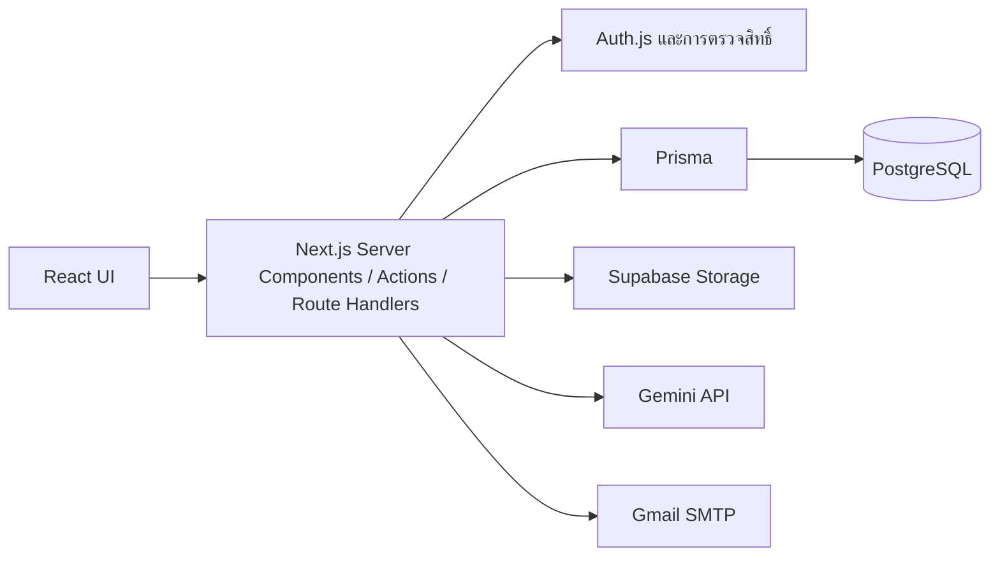

# Prompty

**แพลตฟอร์มแบ่งปัน Code Snippets และ AI Prompts สำหรับนักพัฒนา ครีเอเตอร์ และผู้เรียน**

Prompty รวมการค้นหา พิจารณาเนื้อหา บันทึก และคัดลอกไปใช้ต่อไว้ในเว็บเดียว ผู้ใช้แบ่งปันผลงาน แลกเปลี่ยนความคิดเห็น และจัดเก็บสิ่งที่สนใจเป็นคอลเลกชันได้ พร้อมเครื่องมือ AI ช่วยเตรียมโพสต์และระบบดูแลเนื้อหาสำหรับผู้ดูแลระบบ

> เอกสารอ้างอิงโค้ด commit `0011a23` และผลตรวจในเครื่องวันที่ **29 กันยายน 2026** สถานะ deployment และบริการภายนอกต้องตรวจแยกจากผลทดสอบใน repository

## สารบัญ

- [ฟีเจอร์](#ฟีเจอร์)
- [เทคโนโลยีและสถาปัตยกรรม](#เทคโนโลยีและสถาปัตยกรรม)
- [ติดตั้งและเริ่มใช้งาน](#ติดตั้งและเริ่มใช้งาน)
- [เส้นทางหลัก](#เส้นทางหลัก)
- [กติกาของระบบ](#กติกาของระบบ)
- [โครงสร้างโปรเจกต์](#โครงสร้างโปรเจกต์)
- [คำสั่งและการทดสอบ](#คำสั่งและการทดสอบ)
- [ข้อจำกัดปัจจุบัน](#ข้อจำกัดปัจจุบัน)
- [เอกสารเพิ่มเติม](#เอกสารเพิ่มเติม)

## ฟีเจอร์

### สำหรับผู้ใช้

- **บัญชีและโปรไฟล์:** สมัครสมาชิก เข้าสู่ระบบด้วยอีเมลและรหัสผ่าน ยืนยันอีเมลด้วย OTP กู้คืนรหัสผ่าน และแก้ไขโปรไฟล์ รูปประจำตัว หรือ social links
- **MFA แบบเลือกเปิด:** ยืนยันเพิ่มด้วยแอป Authenticator พร้อม QR สำหรับตั้งค่าและ Backup Codes แบบใช้ครั้งเดียว
- **โพสต์สองประเภท:** แชร์ Code Snippet พร้อมภาษาโค้ด หรือ AI Prompt พร้อมชื่อโมเดลและภาพประกอบ สร้าง แก้ไข และลบโพสต์ของตนเองได้
- **เครื่องมือเขียนโค้ด:** editor พร้อม syntax highlighting และการตรวจจับภาษาเบื้องต้น
- **AI ช่วยเตรียมโพสต์:** ปรับปรุง Prompt/Code และแนะนำแท็กเมื่อผู้ใช้กดขอ พร้อมให้ตรวจผลก่อนเลือกนำไปใช้
- **ค้นหาและสำรวจ:** ค้นหาโพสต์ ผู้ใช้ และแท็ก กรองผลตามประเภทหรือภาษา และเลือกดู Trending, Categories, Tags และ Leaderboard
- **ชุมชน:** โหวตขึ้น/ลง แสดงความคิดเห็น ติดตามผู้ใช้ และรายงานโพสต์
- **คัดลอกและแชร์:** คัดลอกเนื้อหา แชร์ลิงก์โพสต์ และนับจำนวนการคัดลอก
- **Bookmarks & Collections:** บันทึกโพสต์ จัดคอลเลกชัน ย้ายรายการ และแชร์คอลเลกชันสาธารณะ
- **การแจ้งเตือน:** โหวต ความคิดเห็น ผู้ติดตาม และยอดคัดลอกถึงเกณฑ์ พร้อมสถานะอ่านแล้ว
- **การแสดงผล:** ธีมสว่าง มืด หรือตามระบบ และธีมแสดงสีโค้ด 5 แบบ

### สำหรับผู้ดูแลระบบ

- **Dashboard:** สถิติผู้ใช้ โพสต์ รายงานค้าง กราฟโพสต์รายวัน กิจกรรมล่าสุด และแท็กยอดนิยม
- **จัดการโพสต์:** ค้นหา กรองประเภท/วันที่ เปิดรายละเอียด และลบโพสต์
- **จัดการรายงาน:** ตรวจเหตุผล ละเว้นรายงาน หรือบันทึกประวัติแล้วลบโพสต์ที่ถูกรายงาน
- **จัดการผู้ใช้:** เปลี่ยนสิทธิ์ USER/ADMIN แบนหรือคืนสถานะ เพิ่มบัญชี Admin และลบบัญชีพร้อมข้อมูลที่เกี่ยวข้อง
- **จัดการแท็ก:** เพิ่ม แก้ชื่อ และกำหนดสถานะ VISIBLE/HIDDEN
- **ตั้งค่าระบบ:** เปลี่ยนอีเมล/รหัสผ่าน Admin และเปิดหรือปิด Maintenance Mode

**Auto-Hide Reports ยังไม่ใช่ฟีเจอร์ที่ทำงานครบ:** มีสวิตช์และค่าตั้งค่า แต่ยังไม่มีตรรกะซ่อนโพสต์ตามจำนวนรายงาน

## เทคโนโลยีและสถาปัตยกรรม

| ส่วน | เทคโนโลยี |
|---|---|
| Framework | Next.js 16.2.9 — App Router, Server Components, Server Actions, Route Handlers |
| UI | React 19.2.4, TypeScript, Lucide React |
| Styling | Tailwind CSS 4, CSS Design Tokens, CSS รายหน้า และ inline styles |
| Database | PostgreSQL บน Supabase, Prisma 7.8.0, PostgreSQL driver adapter |
| Authentication | Auth.js / NextAuth 5.0.0-beta.31, Credentials provider, JWT sessions |
| Password / MFA | bcryptjs, otplib, QRCode, Node.js crypto |
| Email | Nodemailer ผ่าน Gmail SMTP |
| Image storage | Supabase Storage |
| AI | Gemini API ผ่าน `@google/generative-ai` |
| Code editor / highlighting | react-simple-code-editor, highlight.js |
| Dashboard charts | Recharts |
| Testing | Node.js test runner, mocks และ PGlite |

หน้าเว็บและหลังบ้านอยู่ใน Next.js application เดียวกัน Server Components โหลดข้อมูลสำหรับหน้าเว็บ ส่วน Client Components จัดการฟอร์มและปฏิสัมพันธ์ การอ่าน/เขียนข้อมูลส่วนใหญ่ผ่าน Server Actions; AI, Upload และ MFA verification มี API routes แยก



ฐานข้อมูลมี 15 models ครอบคลุมผู้ใช้ ข้อมูล Auth โพสต์ โหวต ความคิดเห็น รายงาน บุ๊กมาร์ก คอลเลกชัน การติดตาม การแจ้งเตือน แท็ก และค่าระบบ ดูรายละเอียดใน [prisma/schema.prisma](prisma/schema.prisma)

## ติดตั้งและเริ่มใช้งาน

### 1. เตรียมสภาพแวดล้อม

- Node.js ที่ตรงกับข้อกำหนด dependencies ปัจจุบัน: **20.19.x ขึ้นไปในสาย 20, 22.12.x ขึ้นไปในสาย 22 หรือ 24 ขึ้นไป**
- npm และ Git
- PostgreSQL สำหรับ development พร้อม connection string
- Supabase project และ Storage สำหรับรูปภาพ
- บัญชี Gmail พร้อม App Password สำหรับส่ง OTP
- Gemini API key และชื่อโมเดลที่บัญชีเข้าถึงได้ หากต้องการใช้ฟีเจอร์ AI

Clone repository ของคุณ แล้วเปิด terminal ในโฟลเดอร์ที่มี `package.json`:

```bash
npm ci
```

### 2. ตั้งค่า environment

สร้างไฟล์ `.env` ที่ root ของโปรเจกต์และแทน placeholder ด้านล่างด้วยค่าของสภาพแวดล้อมที่ต้องการใช้งาน **ตัวอย่างนี้ไม่มี credentials ที่ใช้งานได้จริง**

```dotenv
# PostgreSQL: URL สำหรับ runtime และ Prisma tooling
DATABASE_URL="postgresql://<DB_USER>:<URL_ENCODED_PASSWORD>@<DB_HOST>:<DB_PORT>/<DB_NAME>"
DIRECT_URL="postgresql://<DB_USER>:<URL_ENCODED_PASSWORD>@<DIRECT_DB_HOST>:<DIRECT_DB_PORT>/<DB_NAME>"

# Authentication
NEXTAUTH_URL="http://localhost:3000"
AUTH_SECRET="<GENERATED_RANDOM_SECRET>"

# Gmail SMTP
EMAIL_USER="<GMAIL_ADDRESS>"
EMAIL_PASS="<GMAIL_APP_PASSWORD>"

# Supabase Storage
NEXT_PUBLIC_SUPABASE_URL="https://<PROJECT_REF>.supabase.co"
NEXT_PUBLIC_SUPABASE_ANON_KEY="<SUPABASE_ANON_KEY>"
SUPABASE_SERVICE_ROLE_KEY="<SERVER_ONLY_SERVICE_ROLE_KEY>"

# AI — ตั้งค่าหากใช้ Enhance / Suggest Tags
GEMINI_API_KEY="<GEMINI_API_KEY>"
GEMINI_MODEL="<MODEL_AVAILABLE_TO_YOUR_ACCOUNT>"
```

สร้างค่า `AUTH_SECRET` ด้วยคำสั่งนี้ แล้วนำผลไปใส่ใน `.env`:

```bash
node -e "console.log(require('node:crypto').randomBytes(32).toString('hex'))"
```

| ตัวแปร | การใช้งาน |
|---|---|
| `DATABASE_URL` | Prisma runtime เชื่อมฐานข้อมูลผ่าน pg adapter |
| `DIRECT_URL` | Prisma tooling เลือกใช้ก่อน `DATABASE_URL`; หากไม่กำหนดจะ fallback ไป `DATABASE_URL` |
| `NEXTAUTH_URL` | URL ของแอป; เปลี่ยนให้ตรงกับ deployment เมื่อใช้งานจริง |
| `AUTH_SECRET` | ใช้กับ Auth รวมถึง OTP digest และ key สำหรับเข้ารหัส MFA secret |
| `EMAIL_USER`, `EMAIL_PASS` | ส่งอีเมลยืนยันและกู้คืนรหัสผ่าน |
| `NEXT_PUBLIC_SUPABASE_URL` | URL ของ Supabase project |
| `NEXT_PUBLIC_SUPABASE_ANON_KEY` | สำหรับ anon client ใน `src/lib/supabase.ts`; upload routes ปัจจุบันใช้ service-role client |
| `SUPABASE_SERVICE_ROLE_KEY` | ใช้อัปโหลดฝั่งเซิร์ฟเวอร์เท่านั้น ห้ามเปลี่ยนเป็นตัวแปร `NEXT_PUBLIC_*` |
| `GEMINI_API_KEY`, `GEMINI_MODEL` | เชื่อม AI และเลือกโมเดลฝั่งเซิร์ฟเวอร์ |

`.env*` ถูก ignore โดย Git แล้ว อย่าใส่ credentials ลง README หรือ source code การเปลี่ยน `AUTH_SECRET` ของระบบที่มีผู้ใช้ MFA อยู่แล้วต้องวางแผนรองรับ เพราะมีผลต่อการถอดรหัส secret เดิมด้วย

### 3. เตรียมฐานข้อมูล

สร้าง Prisma Client:

```bash
npx prisma generate
```

**เฉพาะฐานข้อมูล development ใหม่ที่ยังไม่มีตาราง** ให้ตรวจว่า URL ชี้ไปฐานข้อมูลที่ถูกต้องก่อนสร้าง schema:

```bash
npx prisma db push
```

Repository ปัจจุบันมี `schema.prisma` แต่ยังไม่มีชุด migration files หากเชื่อมฐานข้อมูลที่ใช้งานอยู่แล้ว ให้ตรวจความต่างของ schema ก่อนปรับฐานข้อมูล ไม่จำเป็นต้อง `db push` ทุกครั้งที่เปิดแอป และ `prisma generate` ไม่ได้สร้างตารางให้

### 4. เตรียม Storage

สร้าง buckets ใน Supabase Storage:

| Bucket | ประเภท | ขนาดสูงสุดที่ API รับ |
|---|---|---|
| `avatars` | รูปโปรไฟล์ | 5 MiB |
| `post-images` | รูปประกอบ Prompt | 10 MiB |

แอปคืน public URL ของรูป จึงต้องตั้งค่า bucket ให้รูปอ่านได้ผ่าน public URL โดยการอัปโหลดของแอปทำผ่านเซิร์ฟเวอร์ รองรับ PNG, JPEG, GIF และ WebP พร้อมตรวจ signature ของไฟล์และ MIME type

### 5. เปิดแอป

```bash
npm run dev
```

เปิด [http://localhost:3000](http://localhost:3000) แล้วสมัครสมาชิกและยืนยันอีเมลก่อนเข้าสู่ระบบ หน้าหลักและหน้าสำรวจส่วนใหญ่ต้องล็อกอิน ส่วนลิงก์คอลเลกชันสาธารณะเปิดให้ผู้เยี่ยมชมดูได้

### 6. เตรียม Admin คนแรก

ยังไม่มี seed script หรือบัญชี Admin เริ่มต้นใน repository:

1. สมัครและยืนยันอีเมลของบัญชีที่จะใช้เป็น Admin
2. ผู้ดูแลฐานข้อมูลเปลี่ยน `User.role` ของบัญชีนั้นเป็น `ADMIN` ผ่านเครื่องมือจัดการฐานข้อมูล เช่น `npx prisma studio`
3. เข้าระบบที่ `/admin/login`; หลังจากมี Admin แล้ว สามารถเพิ่ม Admin คนอื่นผ่านหน้า `/admin/users`

ทดสอบฝั่งผู้ใช้และ Admin พร้อมกันด้วย browser profiles คนละชุด หรือหน้าต่างปกติคู่กับ Incognito เพื่อแยก session

### รันแบบ production ในเครื่อง

```bash
npm run build
npm start
```

Build script เรียก `prisma generate` ก่อน `next build` การ deploy ต้องตั้งค่า environment ของปลายทางเอง และตรวจ PostgreSQL, SMTP, Storage และ Gemini ด้วยสภาพแวดล้อมนั้น

## เส้นทางหลัก

| หน้า | URL |
|---|---|
| Feed | `/` |
| สมัคร / เข้าสู่ระบบ | `/register`, `/login` |
| ยืนยันอีเมล / MFA | `/verify-email`, `/verify-mfa` |
| กู้คืนรหัสผ่าน | `/forgot-password`, `/reset-password` |
| ค้นหา | `/search?q=...` |
| Trending / Leaderboard | `/trending`, `/leaderboard` |
| หมวดหมู่ / แท็ก | `/categories`, `/categories/[slug]`, `/tags`, `/tags/[tag]` |
| รายละเอียดโพสต์ | `/post/[id]` |
| โปรไฟล์ | `/profile`, `/profile/[id]` |
| บันทึก / คอลเลกชัน | `/bookmarks`, `/collections/[id]` |
| การตั้งค่า | `/settings/profile`, `/settings/account`, `/settings/notifications`, `/settings/appearance`, `/settings/security` |
| Admin | `/admin/login`, `/admin`, `/admin/posts`, `/admin/posts/reports`, `/admin/users`, `/admin/tags`, `/admin/settings` |

เปิดโพสต์จากการนำทางภายในสามารถแสดงเป็น modal ผ่าน Intercepting Routes ส่วนเปิดลิงก์ตรงหรือ refresh จะแสดงหน้ารายละเอียดเต็ม

API มี 6 เส้นทาง: `/api/auth/[...nextauth]`, `/api/mfa/verify`, `/api/upload`, `/api/upload-avatar`, `/api/ai/enhance` และ `/api/ai/suggest-tags`

## กติกาของระบบ

### คะแนนและการค้นหา

| ส่วน | กติกา |
|---|---|
| Feed | เรียงโพสต์ใหม่ก่อน |
| Trending | เรียงโพสต์ตาม Upvote − Downvote |
| Leaderboard / Top Contributors | รวม Copy Count + Upvote − Downvote ของโพสต์ผู้ใช้ เฉพาะ USER ที่ไม่ถูกแบน |
| ช่วงสัปดาห์ / เดือน | เลือกโพสต์ที่สร้างใน 7 / 30 วันที่ผ่านมา แล้วรวมคะแนนปัจจุบันของโพสต์เหล่านั้น |
| Search | ค้น title, description และ tags ของโพสต์ รวมถึง name/handle ของผู้ใช้; ไม่ใช่ semantic search |
| Categories | จับคู่ tags, language และ aiModel กับรายการหมวดหมู่ในโค้ด; โพสต์อยู่หลายหมวดได้ และมีหมวด “อื่น ๆ” เป็น fallback |

Top Contributors cache 5 นาที และรายการแท็กรวม cache 10 นาที ส่วนจำนวนหมวดหมู่คำนวณจากข้อมูลปัจจุบัน จำนวนคัดลอกเป็นจำนวนครั้ง ไม่ใช่จำนวนคนไม่ซ้ำ

### บัญชีและสิทธิ์

- Email OTP ใช้ยืนยันอีเมลและกู้รหัสผ่าน ส่วน login ใช้อีเมล/รหัสผ่าน
- MFA เป็นตัวเลือกเพิ่มด้วย TOTP และยืนยันแยกตาม login session; Backup Code ใช้ได้ครั้งเดียว
- OTP อายุ 10 นาที; reset grant ผูกอีเมล ใช้ครั้งเดียว และส่งผ่าน HttpOnly cookie
- รหัสผ่านขั้นต่ำ 8 ตัวอักษร สูงสุด 72 ไบต์; เปลี่ยนรหัสแล้ว session เก่าใช้ต่อไม่ได้
- Proxy จัดการ redirect; mutations และ API ที่เกี่ยวข้องตรวจ session/สิทธิ์ฝั่ง server เพิ่ม
- Maintenance กั้นสมาชิกทั่วไปและเปิดให้ Admin จัดการระบบได้

### AI, Bookmarks และ Notifications

- AI Enhance สำหรับ PROMPT ถูกออกแบบให้ช่วยปรับคำสั่งสร้างภาพ ส่วน CODE ช่วยปรับโค้ดและ comments
- ชื่อโมเดลในโพสต์เป็นข้อมูลประกอบ ไม่ได้เปลี่ยนโมเดล Gemini ที่ประมวลผลปุ่ม AI
- ผู้ใช้ยังสร้างโพสต์ได้เมื่อไม่ใช้ AI; ฟีเจอร์ AI ขึ้นอยู่กับการตั้งค่า โควตา และความพร้อมของบริการ
- Bookmark หนึ่งโพสต์อยู่ได้หนึ่ง collection ต่อผู้ใช้; ลบ collection แล้ว bookmark ยังคงอยู่
- Private collection เห็นได้เฉพาะเจ้าของ ส่วน public collection แชร์ลิงก์ได้
- Notifications ดึงข้อมูลเป็นระยะทุก 60 วินาทีและเมื่อเปิด dropdown ไม่ได้ใช้ WebSocket

### ขีดจำกัดคำขอหลัก

| งาน | เพดานในแอป |
|---|---|
| ส่ง OTP | 1 ครั้ง/นาที และ 5 ครั้ง/ชั่วโมง/อีเมล; รวม 100 ครั้ง/ชั่วโมง |
| ตรวจ OTP / MFA | 10 ครั้ง/15 นาทีต่ออีเมลหรือผู้ใช้ตาม scope |
| AI Enhance + Suggest Tags | รวม 5 ครั้ง/นาที และ 40 ครั้ง/วัน/ผู้ใช้ |
| Upload | รวม 10 ครั้ง/นาที/ผู้ใช้ |
| Copy tracking | 60 ครั้ง/นาที/ผู้ใช้ |

Rate limiter ใช้ atomic PostgreSQL upsert ใน `SystemSetting` ภายใต้ prefix `__rate:` รายละเอียด scope เพิ่มเติมอยู่ในโค้ดและ [PROJECT_CONTEXT.md](PROJECT_CONTEXT.md)

## โครงสร้างโปรเจกต์

```text
prompty/
├── prisma/
│   └── schema.prisma
├── public/                     # โลโก้และ stylesheet ของ code themes
├── src/
│   ├── app/
│   │   ├── @modal/             # Intercepted post detail
│   │   ├── admin/              # Login และ dashboard ของ Admin
│   │   ├── api/                # Auth, MFA, Upload และ AI
│   │   ├── bookmarks/          # รายการบันทึกและจัด collections
│   │   ├── collections/        # รายละเอียด collection ที่แชร์
│   │   ├── categories/        # หมวดหมู่และโพสต์ในหมวด
│   │   ├── leaderboard/       # อันดับผู้ใช้
│   │   ├── post/              # รายละเอียดโพสต์
│   │   ├── profile/           # โปรไฟล์ตนเองและผู้อื่น
│   │   ├── search/            # ผลการค้นหา
│   │   ├── settings/          # ตั้งค่าบัญชีและ MFA
│   │   ├── tags/              # แท็กและโพสต์ในแท็ก
│   │   ├── trending/          # โพสต์ตามคะแนนโหวต
│   │   ├── login/, register/, verify-email/, verify-mfa/
│   │   ├── forgot-password/, reset-password/, maintenance/
│   │   ├── layout.tsx
│   │   └── globals.css
│   ├── components/            # UI แยกตามส่วนงานและ providers
│   ├── lib/
│   │   ├── actions/           # Business logic และ Server Actions
│   │   ├── constants/         # หมวดหมู่และ aliases
│   │   ├── prisma.ts          # Database client
│   │   ├── session.ts         # Session/MFA/maintenance guards
│   │   ├── security-tokens.ts # OTP/reset/session helpers
│   │   ├── rate-limit.ts      # PostgreSQL rate limiter
│   │   ├── mfa.ts             # TOTP, encryption และ backup codes
│   │   ├── gemini.ts          # AI generation
│   │   ├── ai-request.ts      # AI request validation/error handling
│   │   ├── upload.ts          # File validation และ Storage upload
│   │   └── notifications.ts   # สร้าง notification ฝั่ง server
│   ├── types/
│   ├── auth.ts                # Auth.js configuration
│   └── proxy.ts               # Route access และ redirects
├── tests/security.test.cjs
├── prisma.config.ts
├── next.config.ts
├── PROJECT_CONTEXT.md
├── SECURITY_HANDOFF.md
└── USER_TESTING.md
```

## คำสั่งและการทดสอบ

| คำสั่ง | หน้าที่ |
|---|---|
| `npm run dev` | เปิด development server |
| `npm run build` | Generate Prisma Client และ build Next.js |
| `npm start` | เปิด production server หลัง build |
| `npm test` | รัน regression tests |
| `npm run lint` | ตรวจ ESLint ทั้งโปรเจกต์ |
| `npx tsc --noEmit --incremental false` | ตรวจ TypeScript โดยไม่เขียน incremental cache |
| `npx prisma generate` | สร้าง Prisma Client จาก schema |
| `npx prisma studio` | เปิดเครื่องมือดู/แก้ฐานข้อมูลที่ตั้งค่าไว้ |

ผลตรวจในเครื่องวันที่ **29 กันยายน 2026**:

| รายการ | ผล |
|---|---|
| Automated tests | **ผ่าน 23/23** |
| TypeScript | **ผ่าน** |
| ESLint เฉพาะ `src` และ `tests` | **30 errors, 76 warnings** |
| Production build | ไม่ได้รันใหม่ในรอบตรวจนี้; บันทึกส่งมอบรอบก่อนระบุว่าผ่าน |
| Browser / บริการจริง | ต้องตรวจเพิ่มเติมตาม environment ที่ใช้งาน |

Tests เน้น OTP/reset authorization, session/MFA, ownership ของ collection, upload validation, AI error handling, rate-limit SQL, category consistency และ password-change redirect ใช้ mocks สำหรับบริการหลายส่วน และ PGlite สำหรับ SQL ของ rate limiter ไม่ได้แทนการทดสอบผ่านเบราว์เซอร์ครบทุกหน้า หรือการทดสอบ PostgreSQL/SMTP/Storage/Gemini ของ production

## ข้อจำกัดปัจจุบัน

- OAuth Google/GitHub ยังไม่ได้ตั้งค่าใช้งาน; ใช้อีเมลและรหัสผ่าน
- Auto-Hide Reports ยังไม่มีตรรกะซ่อนโพสต์ แม้มีสวิตช์ตั้งค่า
- มี preferences สำหรับ digest/security แต่ยังไม่พบงานส่งแจ้งเตือนสองประเภทนี้แยกต่างหาก
- ไม่มีหน้า Admin reset MFA หรือ flow สร้าง Backup Codes ชุดใหม่แยกต่างหาก
- Search คืนโพสต์สูงสุด 50 รายการ และเรียง top หลังเลือก 50 รายการล่าสุด; หลายหน้าดึงข้อมูลแล้วคำนวณในแอป จึงยังไม่มีหลักฐานรองรับการใช้งานข้อมูลขนาดใหญ่
- การซ่อน Tag ไม่ใช่การซ่อนโพสต์ และเปลี่ยนชื่อ Tag ไม่ได้เปลี่ยน `Post.tags` ย้อนหลัง
- สถิติ copies ในโปรไฟล์ตนเองยังคำนวณจาก comments ต่างจาก public profile/leaderboard; การลบ avatar มีจุดที่ค่า empty string ถูกข้ามใน update
- ยังมี lint errors/warnings และส่วนที่ควรทบทวนเรื่อง runtime input validation กับข้อมูลที่ read actions ส่งให้ client ดูหลักฐานเพิ่มเติมในบันทึกบริบท

## เอกสารเพิ่มเติม

- [PROJECT_CONTEXT.md](PROJECT_CONTEXT.md) — ภาพรวมเชิงเทคนิค กติกา รายละเอียดแต่ละระบบ และข้อสังเกตจากโค้ด
- [USER_TESTING.md](USER_TESTING.md) — รายการทดสอบผ่านหน้าจอและบริการจริง
- [SECURITY_HANDOFF.md](SECURITY_HANDOFF.md) — บันทึกการแก้และผลตรวจวันที่ 23 กันยายน 2026; บางข้อมูล เช่น branch และจำนวน tests เป็นสถานะในวันนั้น

หากใช้ coding agent ให้ทำตาม [AGENTS.md](AGENTS.md) โดยอ่านคู่มือ Next.js เวอร์ชันที่ติดตั้งใน `node_modules/next/dist/docs/` ก่อนแก้ส่วนที่เกี่ยวข้อง
